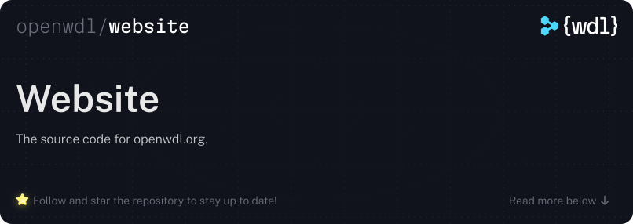

<div style="align: center">
  
</div>

<br />

The source for the [OpenWDL website](https://openwdl.org): homepage,
documentation, blog, get-started wizard, and brand guidelines.

The site is a [React](https://react.dev) application built with
[Vite](https://vite.dev). Every route is prerendered to static HTML at build
time and published to GitHub Pages, so the deployed site is fully static and
hydrates into a client-side app on load.

> [!NOTE]
> The redesigned site lives on the `main` branch. `master` is still the default
> branch and still serves the live site; see [Deployment](#deployment).

## Repository layout

| Path                     | Contents                                                      |
| ------------------------ | ------------------------------------------------------------- |
| `site/`                  | The website application (npm workspace `@openwdl/site`).      |
| `site/src/content/blog/` | Blog posts, one Markdown file per post.                        |
| `site/src/content/docs/` | Documentation pages, compiled into routes and a search index.  |
| `site/src/routes/`       | The route manifest, including legacy-URL redirects.            |
| `site/public/`           | Static files copied verbatim into the build output.            |
| `assets/`                | Brand assets (logos, icons); copied into the build.            |
| `brand-guidelines.pdf`   | The downloadable brand guidelines, served from the site.       |

## Getting started

Requires [Node.js](https://nodejs.org) 22 or newer.

```sh
npm ci        # install dependencies (run from the repository root)
npm run dev -w @openwdl/site
```

`dev` regenerates the docs and blog route data, then starts Vite on
`http://localhost:5173`.

### Other commands

All commands run from the repository root.

```sh
npm run build -w @openwdl/site        # full static build into site/dist
npm test -w @openwdl/site             # unit and component tests
npm run test:static -w @openwdl/site  # assertions against the built output
npm run lint -w @openwdl/site         # eslint
```

The build honors `OPENWDL_BASE` for the public base path. It defaults to `/`,
which is what this repository deploys.

## Editing the site

See [EDITING.md](EDITING.md) for how to add a blog post or a documentation page.

## Deployment

`Lint & Test` runs on every pull request and on pushes to `main`.

`Deploy site to Pages` builds `site/dist` and publishes it to GitHub Pages. It
is currently **manual only** (`workflow_dispatch`) so that staging work on
`main` cannot replace the live site by accident. At cutover:

1. Run `Deploy site to Pages` from the Actions tab and confirm the result.
2. Make `main` the default branch.
3. Add a `push: branches: [main]` trigger to
   `.github/workflows/deploy-pages.yml` so deployments become automatic.

## Contributing

1. Open a [GitHub issue](https://github.com/openwdl/openwdl.github.io/issues)
   describing the change.
2. Create a branch, commit your changes, and push them.
3. [Open a pull request](https://github.com/openwdl/openwdl.github.io/compare)
   referencing the issue.

## License

© 2026-Present The OpenWDL Developers. Available under either the MIT license,
in [LICENSE-MIT](LICENSE-MIT), or the Apache License 2.0, in
[LICENSE-APACHE](LICENSE-APACHE), at your option.
